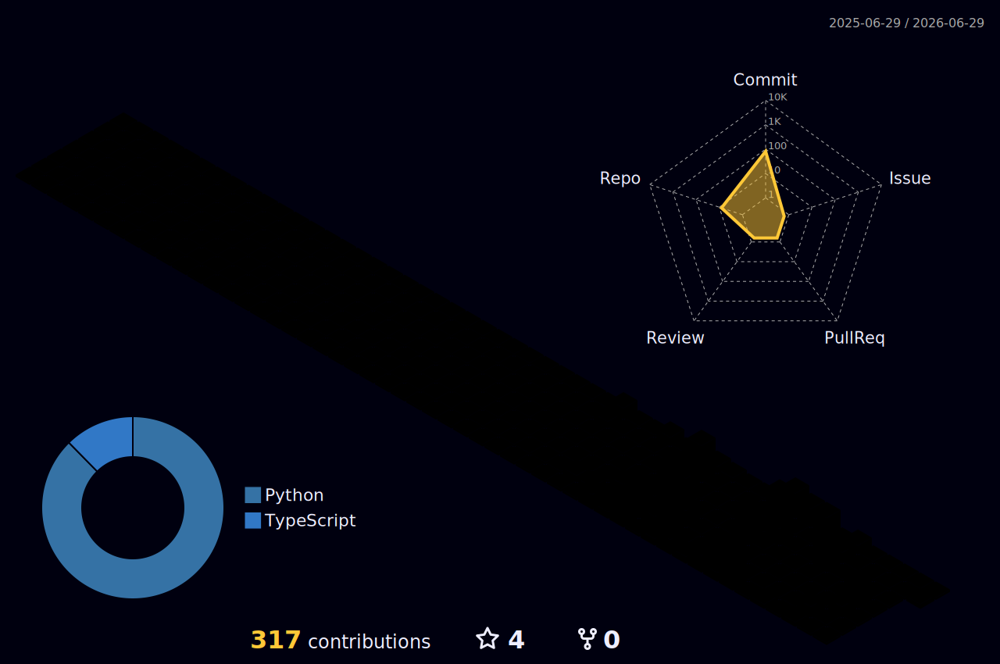

  

  

  
  
  
  

---

<h2>🧑‍💻 About me</h2>

<table>
<tr>
<td width="60%">

- 📍 Bilbao, Spain
- 🎓 BSc **Physics** 
- 🔬 Currently working with **a real fallout t60 armor and polymarket automatized bots**
- 🎯 Building intelligent systems that actually work
- 🐛 Putting my life in danger since 2017

</td>
<td width="40%" align="center">

</td>
</tr>
</table>

---

<h2>📊 GitHub Stats</h2>

  
  

---

<h2>🌐 3D Contribution Graph</h2>

  

